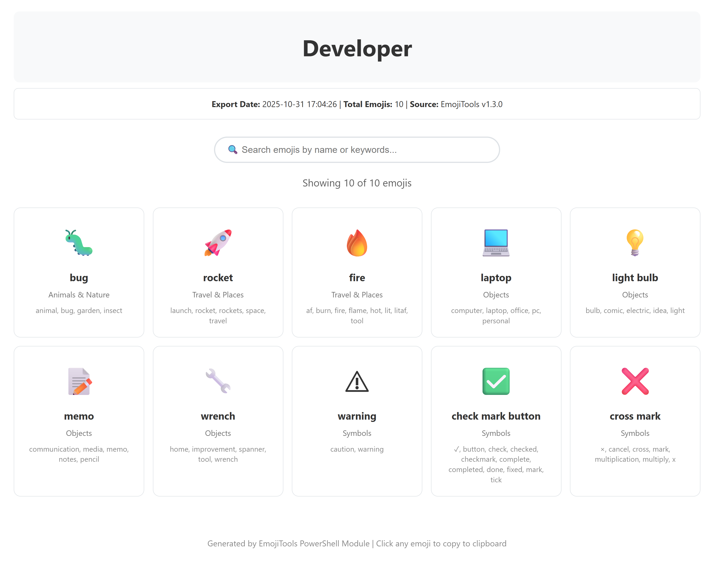
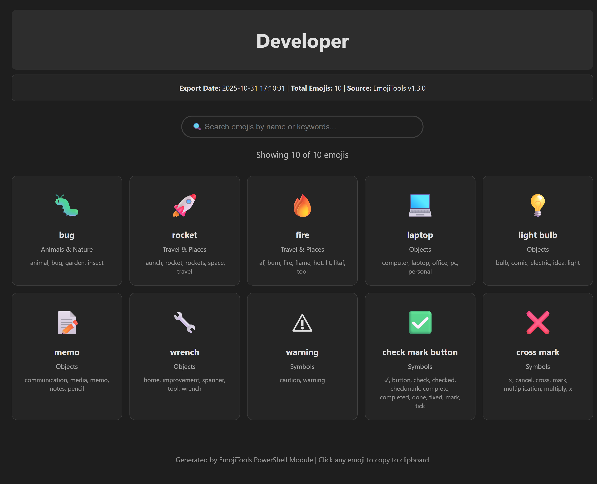
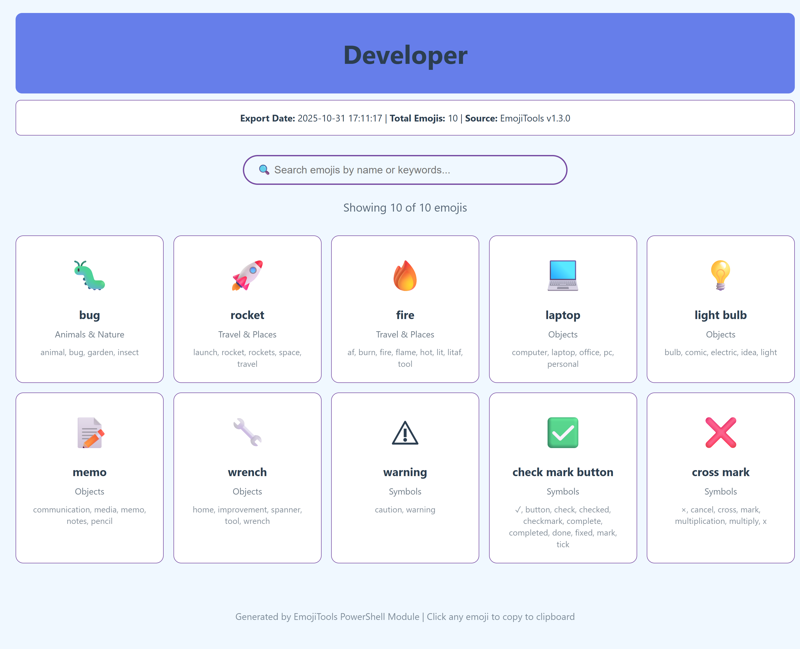

# Export Guide

Export your emoji data to various formats for use in other applications, documentation, or sharing.

## Overview

The `Export-Emoji` function allows you to export emojis in multiple formats:
- **JSON** - Structured data for applications
- **HTML** - Interactive web pages with styling
- **Markdown** - Documentation-friendly format
- **CSV** - Spreadsheet-compatible format

## Supported Formats

### JSON Export

Export emojis as structured JSON data:

```powershell
# Export all emojis to JSON
Export-Emoji -Format JSON -OutputPath "emojis.json"

# Export specific category
Export-Emoji -Format JSON -Category "Food & Drink" -OutputPath "food-emojis.json"

# Export search results
Export-Emoji -Format JSON -Query "heart" -OutputPath "hearts.json"
```

**Output Example:**
```json
[
  {
    "emoji": "😀",
    "name": "grinning face",
    "category": "Smileys & Emotion",
    "codepoint": "1F600"
  },
  {
    "emoji": "😃",
    "name": "grinning face with big eyes",
    "category": "Smileys & Emotion",
    "codepoint": "1F603"
  }
]
```

### HTML Export

Create beautiful, interactive HTML pages:

```powershell
# Light theme (default)
Export-Emoji -Format HTML -OutputPath "emojis.html"

# Dark theme
Export-Emoji -Format HTML -StyleTheme Dark -OutputPath "emojis-dark.html"

# Colorful theme
Export-Emoji -Format HTML -StyleTheme Colorful -OutputPath "emojis-color.html"

# With custom title and metadata
Export-Emoji -Format HTML -Title "My Favorite Emojis" -IncludeMetadata -OutputPath "favorites.html"
```

**Features:**
- 🎨 Three built-in themes (Light, Dark, Colorful)
- 🔍 Live search functionality
- 📂 Category filtering
- 📋 Click to copy emojis
- 📱 Responsive design
- 🌐 Self-contained (no external dependencies)

### Markdown Export

Perfect for documentation and README files:

```powershell
# Export to Markdown
Export-Emoji -Format Markdown -OutputPath "emojis.md"

# With metadata header
Export-Emoji -Format Markdown -IncludeMetadata -Title "Emoji Reference" -OutputPath "reference.md"

# Export specific category
Export-Emoji -Format Markdown -Category "Travel & Places" -OutputPath "travel.md"
```

**Output Example:**
```markdown
# Emoji Collection

## Smileys & Emotion

| Emoji | Name | Codepoint |
|-------|------|-----------|
| 😀 | grinning face | 1F600 |
| 😃 | grinning face with big eyes | 1F603 |
| 😄 | grinning face with smiling eyes | 1F604 |

## Animals & Nature

| Emoji | Name | Codepoint |
|-------|------|-----------|
| 🐶 | dog face | 1F436 |
| 🐱 | cat face | 1F431 |
```

### CSV Export

For use in Excel, Google Sheets, or data analysis:

```powershell
# Export to CSV
Export-Emoji -Format CSV -OutputPath "emojis.csv"

# Export with filtering
Export-Emoji -Format CSV -Category "Symbols" -OutputPath "symbols.csv"
```

**Output Format:**
```csv
emoji,name,category,codepoint
😀,grinning face,Smileys & Emotion,1F600
😃,grinning face with big eyes,Smileys & Emotion,1F603
😄,grinning face with smiling eyes,Smileys & Emotion,1F604
```

## Advanced Usage

### Filtering Before Export

#### By Category
```powershell
Export-Emoji -Format HTML -Category "Food & Drink" -OutputPath "food.html"
```

#### By Search Query
```powershell
Export-Emoji -Format JSON -Query "flag" -OutputPath "flags.json"
```

#### Limit Results
```powershell
Export-Emoji -Format Markdown -Limit 50 -OutputPath "top-50.md"
```

#### Combine Filters
```powershell
Export-Emoji -Format HTML `
    -Category "Smileys & Emotion" `
    -Query "smile" `
    -Limit 20 `
    -OutputPath "smiles.html"
```

### Pipeline Export

Export search results or collections directly:

```powershell
# Search then export
Search-Emoji "heart" | Export-Emoji -Format HTML -OutputPath "hearts.html"

# Get category then export
Get-Emoji -Category "Animals & Nature" | Export-Emoji -Format JSON -OutputPath "animals.json"

# Export a collection
Get-EmojiCollection -Name "Favorites" | Export-Emoji -Format HTML -StyleTheme Dark -OutputPath "favorites.html"

# Export multiple collections combined
$myEmojis = @()
$myEmojis += Get-EmojiCollection -Name "Work"
$myEmojis += Get-EmojiCollection -Name "Personal"
$myEmojis | Export-Emoji -Format HTML -Title "My Collections" -OutputPath "my-collections.html"
```

### Theme Customization

HTML exports support three themes:

#### Light Theme
```powershell
Export-Emoji -Format HTML -StyleTheme Light -OutputPath "light.html"
```
- Clean, professional look
- White background
- Ideal for documentation

#### Dark Theme
```powershell
Export-Emoji -Format HTML -StyleTheme Dark -OutputPath "dark.html"
```
- Easy on the eyes
- Dark background
- Great for night viewing

#### Colorful Theme
```powershell
Export-Emoji -Format HTML -StyleTheme Colorful -OutputPath "colorful.html"
```
- Vibrant, playful design
- Color-coded categories
- Fun and engaging

### Include Metadata

Add export information to your files:

```powershell
Export-Emoji -Format HTML -IncludeMetadata -OutputPath "emojis.html"
```

Metadata includes:
- Export date and time
- Total emoji count
- Dataset version
- Source information
- Filter criteria used

### PassThru Mode

Get content without saving to file:

```powershell
# Get JSON string
$json = Export-Emoji -Format JSON -PassThru

# Get HTML content
$html = Export-Emoji -Format HTML -StyleTheme Dark -PassThru

# Use in pipeline
Export-Emoji -Format Markdown -PassThru | Set-Clipboard
```

## Use Cases

### Export Collections

Export your saved emoji collections with ease:

#### Simple Approach (Recommended)

Use the `-Collection` parameter for easy one-line exports:

```powershell
# Export a single collection by name
Export-Emoji -Format HTML -Collection "Favorites" -StyleTheme Colorful -OutputPath "favorites.html"

# Export using pipeline (title automatically set to collection name)
Get-EmojiCollection -Name "Developer" | Export-Emoji -Format HTML -StyleTheme Colorful

# Export all collections to separate files
Get-EmojiCollection | ForEach-Object {
    Export-Emoji -Format HTML -Collection $_.Name -StyleTheme Light -OutputPath "$($_.Name).html"
    Write-Host "✅ Exported collection '$($_.Name)'"
}

# Combine multiple collections
$combined = @()
@("Work", "Personal", "Projects") | ForEach-Object {
    $combined += Get-EmojiCollection -Name $_
}
$combined | Export-Emoji -Format JSON -OutputPath "all-my-collections.json"
```

#### Advanced Approach (Manual)

For more control, manually retrieve emoji data:

> **Note:** This approach is useful when you need to further filter or manipulate collection emojis before exporting.

```powershell
# Manual method with full control
$collection = Get-EmojiCollection -Name "Developer"
$allEmojis = Get-Emoji
$collectionData = $allEmojis | Where-Object { $collection.Emojis -contains $_.emoji }
$collectionData | Export-Emoji -Format HTML `
    -Title $collection.Name `
    -StyleTheme Colorful `
    -OutputPath "$($collection.Name).html"

# Export all collections with additional filtering
$allEmojis = Get-Emoji
$collections = Get-EmojiCollection

foreach ($collName in ($collections | ForEach-Object { $_.Name })) {
    $coll = Get-EmojiCollection -Name $collName
    $emojiData = $allEmojis | Where-Object {
        $coll.Emojis -contains $_.emoji -and
        $_.category -eq "Smileys & Emotion"  # Additional filter
    }

    if ($emojiData.Count -gt 0) {
        $emojiData | Export-Emoji -Format HTML `
            -Title "$collName (Smileys Only)" `
            -OutputPath "$collName-smileys.html"
    }
}
```


### Create Emoji Cheat Sheet

```powershell
# Export all emojis to searchable HTML reference
Export-Emoji -Format HTML `
    -Title "Emoji Cheat Sheet" `
    -IncludeMetadata `
    -StyleTheme Colorful `
    -OutputPath "emoji-cheatsheet.html"
```

### Documentation Reference

```powershell
# Create Markdown reference for docs
Export-Emoji -Format Markdown `
    -Title "Available Emojis" `
    -IncludeMetadata `
    -OutputPath "docs/emoji-reference.md"
```

### Category Collections

```powershell
# Export each category separately
$categories = @(
    "Smileys & Emotion",
    "People & Body",
    "Animals & Nature",
    "Food & Drink",
    "Travel & Places"
)

foreach ($cat in $categories) {
    $filename = $cat -replace '& ', '' -replace ' ', '-'
    Export-Emoji -Format HTML `
        -Category $cat `
        -Title $cat `
        -StyleTheme Light `
        -OutputPath "exports/$filename.html"
}
```

### Data Analysis

```powershell
# Export to CSV for analysis in Excel
Export-Emoji -Format CSV -OutputPath "emoji-data.csv"

# Then open in Excel or import to Python/R for analysis
```

### Share Emoji Collections

```powershell
# Create shareable HTML page of favorites
New-EmojiCollection -Name "Favorites" -Emojis @("🎉", "🚀", "❤️", "✅", "🔥")
Get-EmojiCollection -Name "Favorites" |
    Export-Emoji -Format HTML `
        -Title "My Favorite Emojis" `
        -StyleTheme Colorful `
        -OutputPath "my-favorites.html"
```

## Format Comparison

| Feature | JSON | HTML | Markdown | CSV |
|---------|------|------|----------|-----|
| Structured Data | ✅ | ❌ | ❌ | ✅ |
| Human Readable | ⚠️ | ✅ | ✅ | ⚠️ |
| Searchable | ❌ | ✅ | ❌ | ❌ |
| Click to Copy | ❌ | ✅ | ❌ | ❌ |
| Themes | ❌ | ✅ | ❌ | ❌ |
| Documentation | ⚠️ | ✅ | ✅ | ❌ |
| Spreadsheets | ❌ | ❌ | ❌ | ✅ |
| Programming | ✅ | ❌ | ❌ | ⚠️ |

### When to Use Each Format

**JSON** - When you need:
- Structured data for applications
- API responses
- Configuration files
- Data interchange

**HTML** - When you need:
- Interactive web pages
- Shareable emoji references
- Visual browsing
- Click-to-copy functionality

**Markdown** - When you need:
- Documentation
- GitHub/GitLab wikis
- README files
- Blog posts

**CSV** - When you need:
- Excel/Google Sheets
- Data analysis
- Database imports
- Simple data exchange

## Screenshots

### HTML Export - Light Theme

*Clean, professional HTML export with search and copy functionality*

### HTML Export - Dark Theme

*Dark theme for comfortable viewing*

### HTML Export - Colorful Theme

*Vibrant, category-color-coded design*

## Related Functions

- **[Export-EmojiHistory](../src/functions/EmojiHistory.ps1)** - Export update history
- **[Export-EmojiCollection](../src/functions/Collections.ps1)** - Export saved collections
- **[Export-EmojiStats](../src/functions/Analytics.ps1)** - Export usage statistics
- **[Export-EmojiAliases](../src/functions/Aliases.ps1)** - Export custom aliases

## See Also

- [QUICKSTART.md](QUICKSTART.md) - Quick start guide
- [COLLECTIONS_GUIDE.md](COLLECTIONS_GUIDE.md) - Managing emoji collections
- [EMOJI_PICKER_GUIDE.md](EMOJI_PICKER_GUIDE.md) - Interactive emoji picker
- [Get-Emoji](../src/functions/Get-Emoji.ps1) - List all emojis
- [Search-Emoji](../src/functions/Search-Emoji.ps1) - Search for emojis
