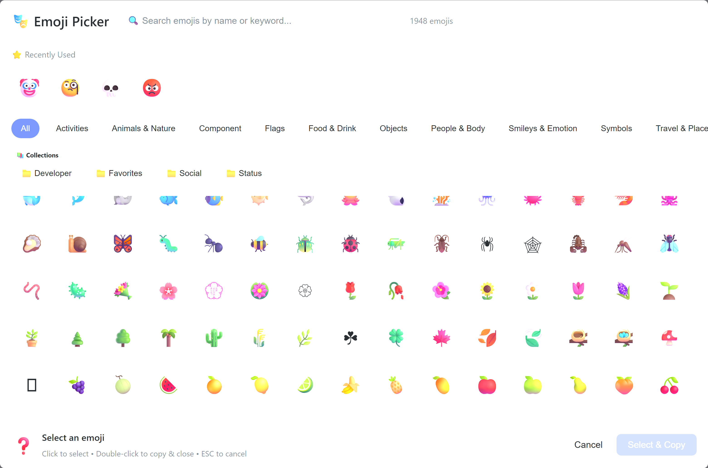
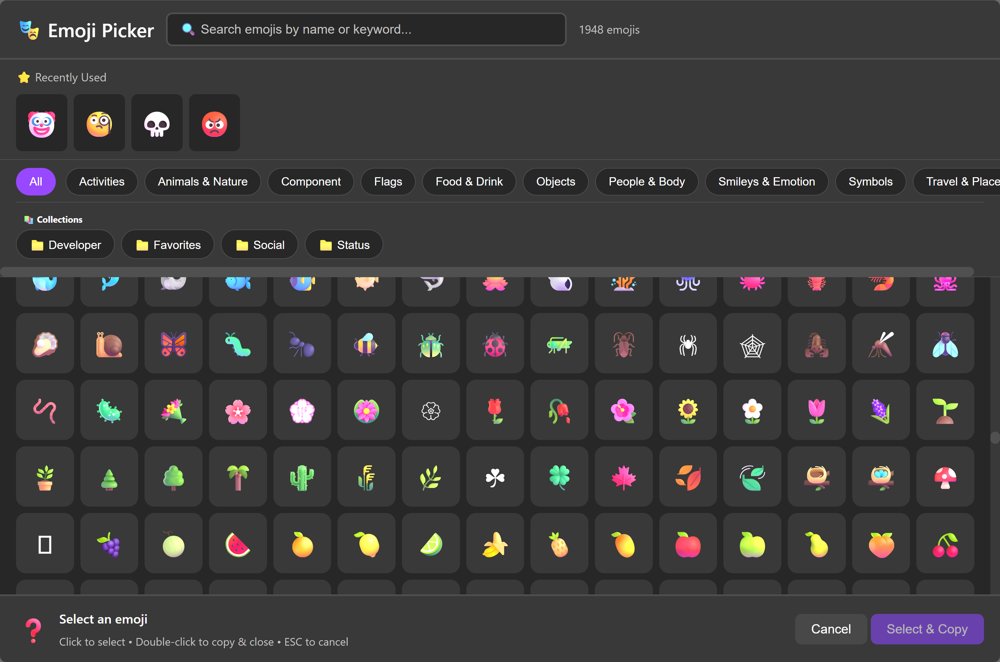
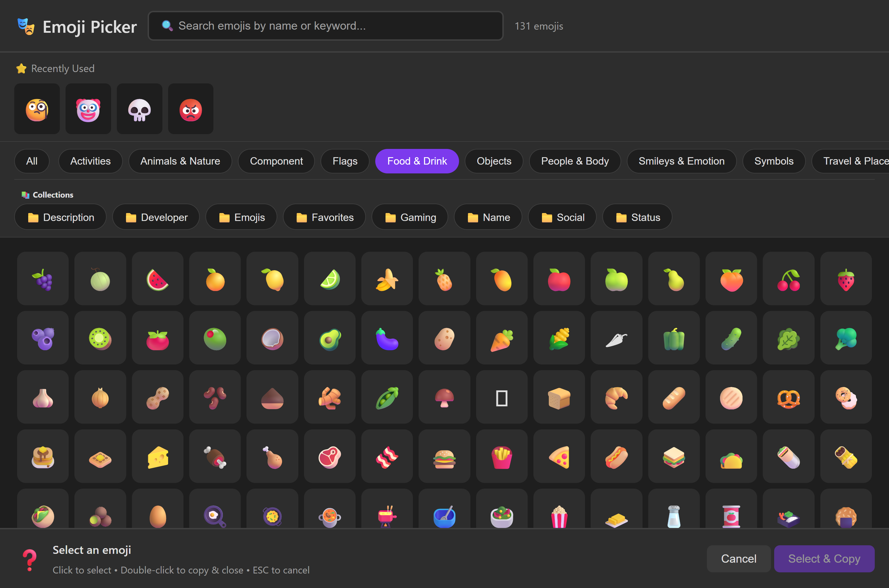
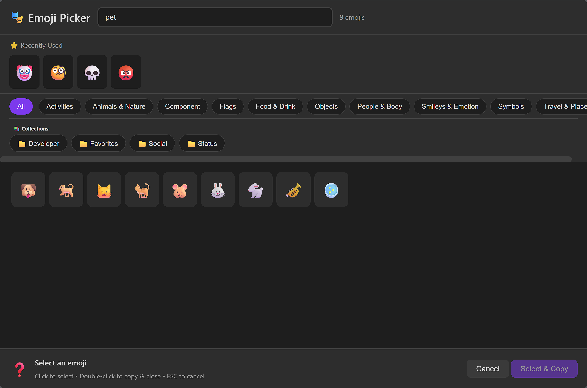

<div align="center" markdown>

{ width="200" }

# EmojiTools

**Your Ultimate PowerShell Emoji Companion** 🚀

Discover, manage, and use 1,900+ emojis right from your PowerShell terminal.
Make your scripts, documentation, and terminal output more expressive and engaging!

[Get Started →](getting-started/installation.md){ .md-button .md-button--primary }
[View on GitHub](https://github.com/Tsabo/EmojiTools){ .md-button }

</div>

---

## ✨ Why Choose EmojiTools?

<div class="grid cards" markdown>

- **🔍 Lightning-Fast Search** - Find any emoji in milliseconds with fuzzy search. Type "rocket" and get 🚀!

- **🔄 Always Up-to-Date** - Automatic updates from Unicode CLDR keep you current with the latest emojis.

- **🎨 Beautiful Emoji Picker** - Interactive browser-based picker with categories, search, and skin tone selection.

- **📁 Organize Your Way** - Create collections for projects, build custom aliases, and export to any format.

- **⚡ Blazing Fast** - Intelligent caching makes searches 10-100x faster. No lag, just instant results!

- **🌐 Cross-Platform** - Works perfectly on Windows, macOS, and Linux. One tool, every platform!

</div>

---

## � Beautiful Interactive Picker

Launch a beautiful browser-based emoji picker with categories, search, and themes!

=== "Light Theme"
    

    Perfect for daytime coding sessions with a clean, bright interface.

=== "Dark Theme"
    

    Easy on the eyes during late-night coding marathons.

=== "Category Browsing"
    

    Browse by category: Smileys, Animals, Food, Travel, and more!

=== "Search & Filter"
    

    Lightning-fast search finds exactly what you need instantly.

```powershell
# Launch the interactive emoji picker
Show-EmojiPicker

# Use with specific category
Show-EmojiPicker -Category "Smileys & Emotion"

# Dark theme for night owls
Show-EmojiPicker -Theme Dark
```

[Learn more about the Emoji Picker →](user-guide/picker.md)

---

## 📤 Export to Any Format

Create beautiful emoji references in HTML, Markdown, JSON, or CSV!

=== "Light HTML"
    

=== "Dark HTML"
    

=== "Colorful HTML"
    

```powershell
# Export to HTML with your favorite theme
Export-Emoji -Format HTML -StyleTheme Light

# Export specific category to Markdown
Export-Emoji -Category "Animals & Nature" -Format Markdown

# Create CSV for data analysis
Export-Emoji -Format CSV -OutputPath "emojis.csv"
```

[Explore Export Options →](user-guide/export.md)

---

## �🎬 See It in Action

### Search in Seconds

```powershell
# Find rocket emojis
Search-Emoji "rocket"
```

**Results:**

```
Emoji  Name              Category         Keywords
-----  ----              --------         --------
🚀     rocket           Travel & Places  launch, rocket, space
🧑‍🚀   astronaut        People & Body    astronaut
👨‍🚀   man astronaut    People & Body    astronaut, man
👩‍🚀   woman astronaut  People & Body    astronaut, woman
```

### Copy to Clipboard

```powershell
# Copy emoji to clipboard
Copy-Emoji "🚀"
# Result: Copied 🚀 to clipboard
```

---

## 💎 Perfect For...

<div class="grid cards" markdown>

- **📝 Documentation** - Make your README files and docs more engaging and visual

- **💬 Team Communication** - Express ideas clearly in Slack, Teams, or email

- **📊 Data Visualization** - Use emojis as data markers in reports and dashboards

- **🐛 Commit Messages** - Create beautiful, semantic git commit messages

- **📚 Learning & Teaching** - Make technical content more approachable

- **🎨 Creative Projects** - Add personality to scripts, logs, and outputs

</div>

---

## 🚀 Quick Start

!!! tip "Get Started in 5 Minutes"
    1. **Install** from PowerShell Gallery: `Install-Module -Name EmojiTools`
    2. **Download** emoji database: `Update-EmojiDataset`
    3. **Search** for emojis: `Search-Emoji "happy"`
    4. **Copy** to clipboard: `Copy-Emoji "😊"`

    [Full installation guide →](getting-started/installation.md)

---

## 💬 What Users Say

!!! quote "Game Changer!"
    "EmojiTools has transformed how I write documentation. README files are now engaging and fun to read!"
    — **Sarah M., Developer**

!!! quote "Lightning Fast"
    "The search is incredibly fast. I find exactly what I need every single time!"
    — **Mike T., DevOps Engineer**

!!! quote "Cross-Platform Win"
    "Works perfectly on all my systems - Windows, Mac, and Linux. No compatibility issues!"
    — **Alex K., SRE**

---

## 📚 Explore the Docs

<div class="grid cards" markdown>

- [**Getting Started**](getting-started/installation.md) - Install and configure EmojiTools
- [**User Guide**](user-guide/searching.md) - Master search, collections, and workflows

</div>

---

## 🎯 Ready to Get Started?

<div align="center" markdown>

### Installation is Quick & Easy!

```powershell
# Install from PowerShell Gallery
Install-Module -Name EmojiTools -Scope CurrentUser

# Download the latest emoji database
Update-EmojiDataset

# Start using it right away!
Search-Emoji "rocket"
```

[📖 Complete Installation Guide →](getting-started/installation.md){ .md-button .md-button--primary }
[⚡ Quick Start Tutorial →](getting-started/quickstart.md){ .md-button }
[📚 Browse All Examples →](getting-started/first-steps.md){ .md-button }

</div>

---

<div align="center" markdown>

Made with ❤️ by the EmojiTools community | [GitHub](https://github.com/Tsabo/EmojiTools) | [Report Issues](https://github.com/Tsabo/EmojiTools/issues)

</div>
