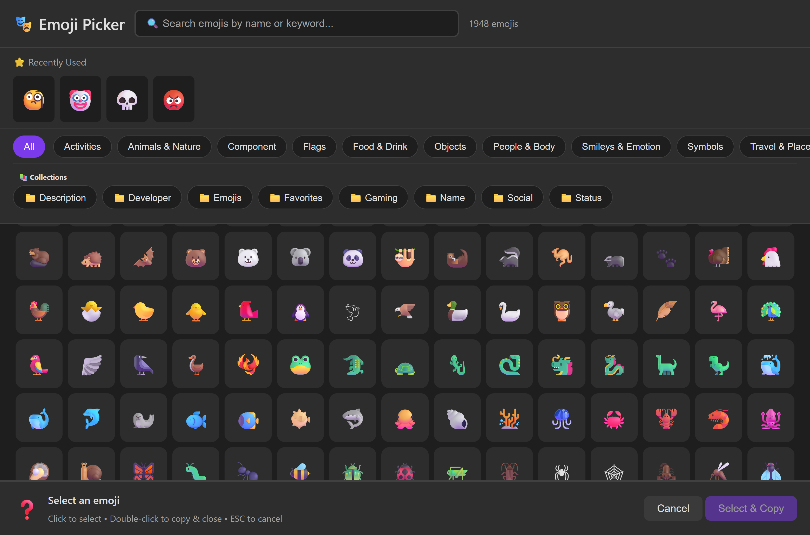
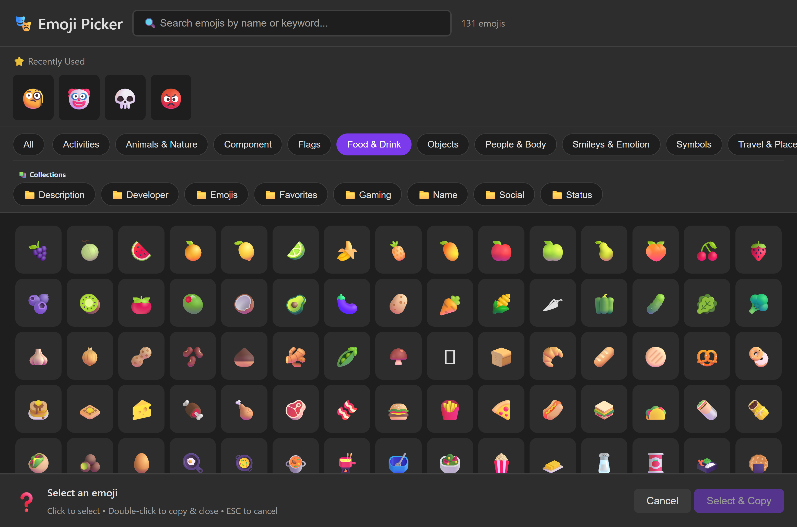

# 🎨 Emoji Picker

The interactive emoji picker is your visual gateway to browsing and selecting emojis. It's perfect when you want to explore categories, compare options, or just browse through the collection.

---

## Quick Start

```powershell
# Open the emoji picker
Show-EmojiPicker
```

That's it! A browser window opens with an interactive emoji picker. Click any emoji to copy it to your clipboard automatically.

---

## ✨ Features at a Glance

<div class="grid cards" markdown>

- **🔍 Real-Time Search** - Type to filter emojis instantly as you search
- **📂 Category Browsing** - Filter by categories like "Smileys", "Animals", "Food"
- **🎨 Skin Tone Selection** - Choose different skin tones for applicable emojis
- **🌓 Theme Support** - Light, dark, or auto-detect system theme
- **📋 Auto-Clipboard** - Selected emojis automatically copy to clipboard
- **⚡ Standalone Mode** - Keep the picker open while working in PowerShell

</div>

---

## How to Use the Picker

### Basic Workflow

1. **Open the picker**: Run `Show-EmojiPicker`
2. **Browse or search**: Use categories or type to search
3. **Click an emoji**: It copies to clipboard automatically
4. **Paste anywhere**: Use `Ctrl+V` to paste your emoji

### The Picker Interface

The emoji picker provides a beautiful, intuitive interface for browsing emojis:

=== "Light Theme"
    

    Clean and professional - perfect for daytime use with excellent readability.

=== "Dark Theme"
    

    Easy on the eyes - ideal for late-night coding sessions or low-light environments.

=== "Category Browsing"
    

    Browse by category - filter to Smileys, Animals, Food, Travel, and more with one click!

=== "Search & Filter"
    

    Lightning-fast search - type to instantly filter thousands of emojis to find exactly what you need.

### Searching in the Picker

The picker includes a built-in search box that filters as you type:

```powershell
Show-EmojiPicker
# Then type "heart" in the search box to see all heart emojis
# Or type "animal" to filter to animals
```

---

## 🎯 Common Scenarios

### Browse by Category

Pre-filter to a specific category when you open the picker:

```powershell
# Show only smileys and emotions
Show-EmojiPicker -Category "Smileys & Emotion"

# Show only animals
Show-EmojiPicker -Category "Animals & Nature"

# Show only food
Show-EmojiPicker -Category "Food & Drink"
```

**Available Categories:**
- Smileys & Emotion
- People & Body
- Animals & Nature
- Food & Drink
- Travel & Places
- Activities
- Objects
- Symbols
- Flags

### Browse Your Collection

Show only emojis from a saved collection:

```powershell
# Show your "Favorites" collection in the picker
Show-EmojiPicker -Collection "Favorites"

# Show your project-specific emojis
Show-EmojiPicker -Collection "MyProject"
```

!!! tip "Collections First"
    Create collections for your frequently used emojis, then use the picker to browse them visually!

### Return Emoji to PowerShell

Instead of just copying to clipboard, return the selected emoji to a variable:

```powershell
# Capture the selected emoji
$emoji = Show-EmojiPicker -ReturnEmoji
Write-Host "You selected: $emoji"

# Use in a string
$message = "$(Show-EmojiPicker -ReturnEmoji) Task complete!"
Write-Host $message
```

---

## 🌓 Theme Options

### Auto-Detect (Default)

The picker automatically matches your system's light/dark mode preference:

```powershell
Show-EmojiPicker -Theme Auto
```

### Force Light Theme

```powershell
Show-EmojiPicker -Theme Light
```

Perfect for bright environments or when you prefer high contrast.

### Force Dark Theme

```powershell
Show-EmojiPicker -Theme Dark
```

Great for night-time use or reducing eye strain.

---

## 🔌 Standalone Mode

Standalone mode opens the picker as a static HTML page without a PowerShell server. This is perfect when you want to keep the picker open while continuing to work.

```powershell
Show-EmojiPicker -Standalone
```

**Standalone Mode Features:**

✅ **Keeps picker open** - Doesn't block your PowerShell session
✅ **Still copies to clipboard** - Click to copy works normally
✅ **No server needed** - Works offline with pre-loaded data
❌ **Can't return to PowerShell** - `-ReturnEmoji` won't work
📌 **Manual close** - You need to close the browser tab yourself

### When to Use Standalone

Use `-Standalone` when you:

- Want an emoji reference open while coding
- Need to select multiple emojis over time
- Don't need to capture the selection in PowerShell
- Are in a restricted network environment

---

## ⚙️ Advanced Options

### Custom Port

If port 8321 is already in use, specify a different port:

```powershell
Show-EmojiPicker -Port 9000
```

### Combining Options

You can combine multiple parameters for precise control:

```powershell
# Dark theme, specific category, return to variable
$emoji = Show-EmojiPicker -Category "Smileys & Emotion" -Theme Dark -ReturnEmoji

# Standalone mode with collection filter
Show-EmojiPicker -Collection "Work" -Standalone -Theme Light
```

---

## 📋 Complete Parameter Reference

### `Show-EmojiPicker`

| Parameter | Type | Required | Description |
|-----------|------|----------|-------------|
| `-Category` | String | No | Pre-filter to a specific category |
| `-Collection` | String | No | Show only emojis from this collection |
| `-Theme` | String | No | Visual theme: `Light`, `Dark`, or `Auto` (default: Auto) |
| `-ReturnEmoji` | Switch | No | Return selected emoji to pipeline instead of clipboard only |
| `-Port` | Int | No | HTTP server port (default: 8321) |
| `-Standalone` | Switch | No | Open as standalone HTML without server |

---

## 💡 Pro Tips

!!! tip "Keyboard Shortcuts"
    - **Tab**: Navigate between search and emojis
    - **Enter**: Select highlighted emoji
    - **Escape**: Close the picker
    - **Type to search**: Start typing to filter instantly

!!! tip "Multiple Selections"
    Use standalone mode if you need to copy multiple emojis. Each click copies to clipboard, so you can paste them one at a time.

!!! tip "Collection Preview"
    Use the picker to preview your collections before exporting or sharing them!

---

## 🔗 Related Topics

- [Searching Emojis](searching.md) - Text-based search when you know what you want
- [Collections](collections.md) - Organize emojis for the picker to display
- [Export & Share](export.md) - Export your selections to files

---

## 🐛 Troubleshooting

### Picker Won't Open

**Problem:** Browser doesn't open or shows error.

**Solution:** Check if port 8321 is available:
```powershell
# Try a different port
Show-EmojiPicker -Port 9000
```

### Emojis Not Copying

**Problem:** Clicking emojis doesn't copy to clipboard.

**Solution:**
1. Make sure you're clicking, not just hovering
2. Try standalone mode: `Show-EmojiPicker -Standalone`
3. Check clipboard access permissions

### Emoji Data Not Found

**Problem:** "Emoji dataset not found" error.

**Solution:** Download the emoji database:
```powershell
Update-EmojiDataset
```

---

<div align="center" markdown>

**Next Steps:** Learn about [exporting emojis](export.md) or explore [advanced search](searching.md)

</div>
